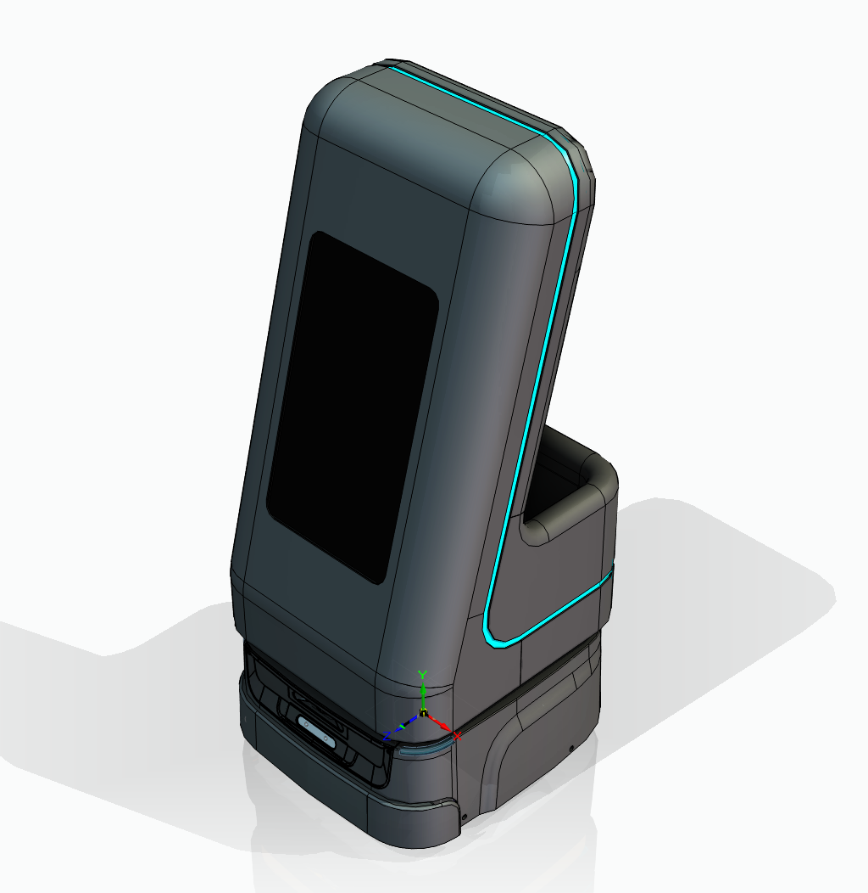

# 2026-004-警务机器人

> 基于思岚 Athena 2.0 底盘（三元锂电池标准版）的警务机器人，含钣金上车体、双屏幕与微型主机等结构模块

## 项目效果图

## 项目内容

1. **二维工程图**
`b-Module-2D` 中存放 AutoCAD 工程图 `工程图.dwg`。
2. **电气图纸**

- 目录 `b-Module-GE` 目前仅有占位文件 `READEME.md`，未放入电气原理图或其他电气资料。

3. **Solid Edge 三维模型**

- 顶层装配：`0-警务机器人.asm`
- 底盘：`1-Athena2.0标准版本（三元锂电池）.asm`，以及 `雅典娜底盘/` 子目录中的 Athena 2.0 底盘零件与装配
- 上车体结构件：`2-结构件.asm`、`2-1-结构件主件.asm`
- 钣金件：`3-钣金件.asm`（前面板、边条、后尾兜、后尾箱、后尾桶等）
- 显示与计算模块：`4-大屏幕.asm`（18.5 寸屏幕）、`5-上屏幕.asm`（宸为 13.5 寸屏幕）、`6-微型主机.asm`（极摩客 K6 AMD-7840HS、电脑安装板、变压器）
- 其他：`7-1-1-音响孔布.par`，国标内六角平圆头螺钉 `GBT70.2-2015 M5X8`

4. **SolidWorks 三维模型**

- `0-装配体.SLDASM`
- `零件.SLDPRT`

5. **办公文档**

- `立项报告.doc`
- `项目报告.pptx`
- `BOM表.xlsx`

6. **项目图片**

- `安装屏幕效果图.PNG`

7. **参考资料**

- 思岚 Athena / Athena 2.0 数据手册与用户手册（`b-References/Slamtec-Athena/`）
- Android 上位机开发资料：Slamware Android SDK 2.8.8、Slamware Android SDK 文档 4.6.0 离线副本、Hermes/Athena2 通用版 RESTful API（Swagger 与接口清单）

## 保留内容
- 本模板项目介绍：此为最初的准备的项目模板
 每个分支项目都会由他去继承
- 作者：Pinavia - 2025
